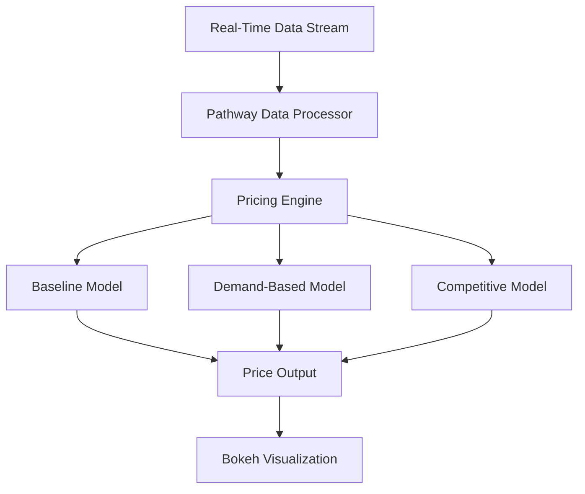

# 📄 **Dynamic Pricing for Urban Parking Lots**  

This project implements an **intelligent dynamic pricing engine** for urban parking spaces using **Python, Pandas, Numpy, Bokeh**, and **Pathway** for real-time simulation.

## ✅ **Models Implemented**

- **Baseline Linear Model:** Adjusts price linearly based on occupancy.
- **Demand-Based Model:** Calculates demand using multiple factors (occupancy, queue length, traffic, special days, vehicle type).
- **Competitive Model:** Adjusts pricing by analyzing competitor lots within 500 meters.

## 📈 **How It Works**

1. **Data Ingestion:** Real-time parking lot data streamed using Pathway.
2. **Pricing Engine:** Three pricing models compute prices dynamically.
3. **Visualization:** Real-time plots generated using Bokeh.

## 📌 **Architecture Diagram**



## 📚 **Usage**

1. Upload your dataset in Colab.
2. Run the simulation loop for each model.
3. Tune parameters for smooth pricing.
4. View real-time pricing and competitor comparisons.

## 🛠️ **Tech Stack**
- Python
- Pandas, Numpy
- Pathway (Real-Time Streaming)
- Bokeh (Visualization)

## ✨ **Key Points**
- Smooth and bounded pricing.
- Supports rerouting vehicles if a lot is full.
- Fully written from scratch using allowed libraries.

## 📂 **Folder Structure**
```
📦 Dynamic-Pricing-Parking-Lot
 ┣ 📜 Dynamic_Pricing_Solution.ipynb
 ┣ 📜 dataset.csv
 ┣ 📜 README.md
```

## ✅ **How to Run**

```bash
# Open notebook in Colab
# Upload dataset.csv
# Run each section step by step
# Modify parameters and visualize
```
